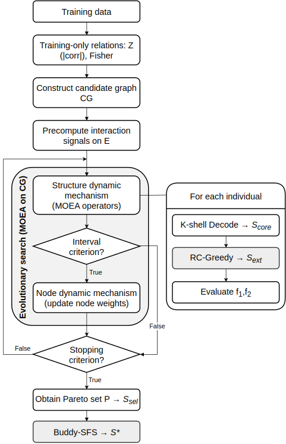

# GBFS-Enh: Graph-Based Multi-Objective Feature Selection with Lightweight Refinements

## Short Description

This repository contains the research implementation for **GBFS-Enh**, a graph-based multi-objective evolutionary feature selection pipeline that extends GBFS-SND with two lightweight refinements:

- **RC-Greedy** (relation-aware k-shell expansion refinement)
- **Buddy-SFS** (post-run neighbor-based sequential refinement)

<p align="center">  
  
</p>  
<p align="center"><em>Overview of the GBFS-Enh evolutionary feature selection pipeline.</em></p>

The codebase includes:

- the enhanced GBFS implementation (OOP pipeline),
- the original/baseline GBFS pipeline,
- traditional and graph-based feature-selection baselines,
- and comparison scripts for reproducible benchmarking on `.mat` datasets.

---

## Paper Information

This repository accompanies the paper:

**“Refining Feature Selection: A Graph-Based Multi-Objective Evolutionary Approach”** (WCCI/CEC 2026 submission / preprint).

> **Note:** Update the BibTeX entry below with final camera-ready metadata (authors, pages, DOI) after publication.

```bibtex
@inproceedings{gbfs_enh_2026,
  title     = {Refining Feature Selection: A Graph-Based Multi-Objective Evolutionary Approach},
  author    = {Anonymous},
  booktitle = {Proceedings of the IEEE Congress on Evolutionary Computation (CEC), WCCI 2026},
  year      = {2026},
  note      = {Submission / preprint; replace with final publication metadata}
}
```

---

## Key Contributions

- **Graph-based MOE feature selection enhancement** built on the GBFS-SND framework.
- **RC-Greedy refinement** during graph-based subset expansion using lightweight relation signals.
- **Buddy-SFS post-refinement** to improve selected subsets using local neighbor additions.
- **Benchmarking pipeline** for comparing GBFS variants against:
  - traditional filter / embedded / wrapper methods,
  - graph-based baselines (InfFS, UGFS),
  - and all-features reference.

- **Reproducible experiment scripts** for local execution and SLURM array jobs.

---

## Method Overview

GBFS-Enh preserves the graph-based representation of feature selection used in GBFS-SND (features as nodes, relations as weighted edges) and optimizes feature subsets in a multi-objective manner (predictive performance vs subset compactness).

The enhancement is implemented as two lightweight refinements:

1.  **RC-Greedy (during search)**  
    A relation-aware k-shell expansion refinement that uses local graph/feature interaction signals to improve candidate subset construction with minimal overhead.
2.  **Buddy-SFS (post-search)**  
    A one-shot / lightweight post-processing refinement that augments selected subsets using neighborhood information and CV-based acceptance.

The implementation is designed for **research benchmarking**, not a generic end-user feature selection library.

---

## Repository Structure

```text
.
├── Compare/
│   ├── run_one_algo.py               # Main single-run benchmarking entrypoint
│   ├── compare_and_log_methods.py    # Comparison/legacy benchmarking pipeline
│   ├── ref_sizes.csv                 # Reference subset sizes for size-matched evaluation
│   └── ...                           # Analysis / utility scripts
├── OOP Code/
│   ├── runner_oop.py                 # GBFS-Enh runner (OOP pipeline)
│   ├── oop_core.py                   # Config dataclasses, initializers, strategy registry
│   ├── sequential_strategies.py      # Post-search refinement strategies
│   ├── newtry_ms.py                  # Core MOE search solver integration
│   ├── gbfs_globals.py               # Shared runtime globals
│   └── ...                           # Helpers, adapters, initialization code
├── Python Code/
│   ├── myinputdatasetXD.py           # Dataset loader (.mat benchmarks)
│   ├── traditional_fs.py             # Traditional FS baselines
│   ├── graph_fs.py                   # Graph-based baselines (InfFS, UGFS)
│   └── ...                           # Legacy GBFS baseline + utilities
├── Data/                             # Benchmark .mat files (user-provided; not bundled)
├── environment.yml                   # Conda environment
├── run_compare.sh                    # SLURM batch submission helper
└── job_slurm_one_dataset.sh          # One-job-per-dataset/algorithm/run SLURM worker
```

---

## Installation

### 1) Clone the repository

```bash
git clone https://github.com/nacon304/PhD-Research_Enhance-GBFS.git
cd PhD-Research_Enhance-GBFS
```

### 2) Create the Conda environment

```bash
conda env create -f environment.yml
conda activate gbfs_enhance
```

---

## Dataset Preparation

### Expected format

Datasets are loaded from MATLAB `.mat` files through `Python Code/myinputdatasetXD.py`.

- Each file should contain a variable named **`Label_data`**
- The **first column** is expected to be the label
- Remaining columns are features

### Default dataset directory

The loader resolves datasets from:

```text
<repo_root>/Data
```

Create the folder if it does not exist:

```bash
mkdir -p Data
```

### Supported benchmark dataset indices (implemented)

| Index | File              | Name        |
| ----: | ----------------- | ----------- |
|     1 | `glass.mat`       | Glass       |
|     2 | `Urban.mat`       | Urban       |
|     3 | `Musk1.mat`       | Musk1       |
|     4 | `USPS.mat`        | USPS        |
|     5 | `madelon.mat`     | Madelon     |
|     6 | `ISOLET.mat`      | ISOLET      |
|     7 | `GINA_01.mat`     | GINA        |
|     8 | `Bioresponse.mat` | Bioresponse |
|     9 | `Colon.mat`       | Colon       |
|    10 | `PIE10P.mat`      | PIE10P      |
|    11 | `GISETTE.mat`     | GISETTE     |
|    12 | `TOX171.mat`      | TOX_171     |

---

## Training Instructions

> This project is a **feature selection benchmarking framework** (not a neural network trainer).  
> “Training” here refers to running feature-selection search and evaluating selected subsets.

### Main entrypoint (recommended)

Use `Compare/run_one_algo.py` for one dataset / one run / one algorithm:

```bash
python Compare/run_one_algo.py \
  --dataset_idx 1 \
  --run 1 \
  --algo "enh:probabilistic:rc_greedy" \
  --out_root "./results" \
  --baseline_root "./Python Code" \
  --oop_root "./OOP Code"
```

### Supported `--algo` formats

#### GBFS variants

- `baseline`  
  Original / baseline GBFS pipeline
- `enh:<init_mode>:<ks_mode>`  
  Enhanced GBFS (GBFS-Enh), e.g.:
  - `enh:knn:normal`
  - `enh:knn:rc_greedy`
  - `enh:probabilistic:normal`
  - `enh:probabilistic:rc_greedy`

#### Traditional baselines (`trad:...`)

Examples supported by `traditional_fs.py`:

- `trad:FILTER_pearson`
- `trad:FILTER_kendall`
- `trad:FILTER_reliefF`
- `trad:FILTER_chi2`
- `trad:FILTER_info_gain`
- `trad:EMB_L1_LogReg`
- `trad:EMB_RF_importance`

#### Graph-based baselines (`graph:...`)

- `graph:InfFS`
- `graph:UGFS`

#### Reference

- `all` (all features)

---

## Evaluation / Inference

### What a single run produces

Each run writes outputs under:

```text
<out_root>/dataset_<idx>/<algo_tag>/run_<run_id>/
```

Typical files include:

- `run_info.json` — run metadata and arguments
- `run_meta.json` — method-specific metadata and configuration summary
- `front_train_cv.csv` — train-side CV/front points (accuracy/size/redundancy summaries)
- `test_points.csv` — test-set evaluations for selected subsets
- `selected_features.txt` — selected subset (for methods that output a single final subset)
- `error.txt` — error details (if a run fails)

---

## Contact

- **Repository issues:** Please use the GitHub Issues tab for bug reports, setup questions, and reproducibility problems.
- **Academic correspondence:** Please contact the corresponding author listed in the paper (or update this section with the final contact email after publication).
